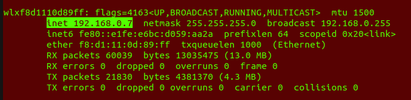

# TurtleBot3 Burger Experimental Setup

[Setup Link](https://emanual.robotis.com/docs/en/platform/turtlebot3/quick-start/)

## Remote PC Setup: Your Host Ubuntu Computer/Laptop/PC

### Step 1: Obtaining IP address
1. Connect to the ARMS_LAB_GUEST Wifi Network
2. Find out the IP address using `ifconfig`

The highlighted text is the IP of your System

### Step 2: Setting Environment Variables

Add ROS_MASTER_URI to the .bashrc file on your system.

`$ echo 'export ROS_MASTER_URI=http://{Replace with the IP obtained from ifconfig}:11311/' >> ~/.bashrc`

Add ROSHOSTNAME to the .bashrc file on your system.

`$ echo 'export ROS_HOSTNAME={Replace with the IP obtained from ifconfig}' >> ~/.bashrc`

Source the .bashrc file

`$ Source ~/.bashrc`

## TurtleBot Configuration

### Step 1: Connect to turtlebot using SSH

Read the IP written the turtlebot and use following command.

`$ ssh ubuntu@<IP of the Robot>`

Password: turtlebot

### Step 2: Changing the ROS_MASTER_URI on Turtlebot

Execute the following command in the turtlebot terminal.

`$ export ROS_MASTER_URI=http://{Replace with the IP obtained from ifconfig}`

**DO NOT CHANGE ANY OTHER ENVIRONMENT VARIABLES ON TURTLEBOT**

## Experimental Setup

### Step 1: Running roscore on your computer/laptop/PC:

Open a new terminal and run roscore

`$ roscore`

### Step 2: Running Bringup Launch on turtlebot

Open a new terminal and connect to turtlebot using ssh and execute

`$ roslaunch turtlebot3_bringup turtlebot3_robot.launch`

### Step 3: Sanity Check

Once callibration is complete, Open new terminal and run

`rostopic list`

If you are able to see a lot rostopics consisting of /odom, /scan, /cmd_vel it sucessfull

If not Please contact a TA

Now you can port your gazebo simulation onto turtlebot hardware by just mapping the required topics!!